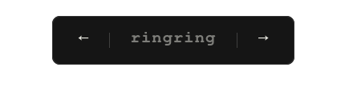

[](https://github.com/razzat008/ringring/actions/workflows/validate.yml)
# 🕸️ ringring

A minimalist, deterministic daily-shuffling webring. The order of sites resets
every midnight, ensuring everyone gets equal time at the "front" of the ring.

Why??\
-> why not?


## How to Join

1. **Fork** this repository.
2. Add your site to `members.json`:
    ```json
    {
      "name": "Your Name",
      "url": "https://your-site.com/",
      "description": "A brief blurb about your corner of the web."
    }
    ```
    *Note: Please include the trailing slash `/` in your URL for consistent matching.*

3. Once merged, add the widget to your site. Follow these [steps to add widget.](#adding-the-widget)
4. **Submit a Pull Request**. Our GitHub Action will automatically validate your JSON.

   ***Note: Widget should look something like this in your site:***
   
---

## Adding the Widget

Copy and paste this snippet into your HTML (usually in the footer):

```html
<div id="webring"></div>
<script src="https://ringring.rajatdahal.com.np/webring.js"></script>
```

### Integration Guides

#### 1. Plain HTML / Static Sites
Drop the snippet directly into your `index.html`.

#### 2. Hugo / Jekyll / Astro
Add the snippet to your `footer` partial or layout file.
```html
<div id="webring"></div>
<script src="https://ringring.rajatdahal.com.np/webring.js"></script>
```

#### 3. React / Next.js
Use `useEffect` to load the script safely. This version prevents duplicate script injection:
```javascript
import { useEffect } from 'react';

export default function Webring() {
  useEffect(() => {
    const existingScript = document.querySelector('script[src*="ringring/webring.js"]');
    if (!existingScript) {
      const script = document.createElement('script');
      script.src = "https://ringring.rajatdahal.com.np/webring.js";
      script.async = true;
      document.body.appendChild(script);
    }
  }, []);

  return <div id="webring"></div>;
}
```

---

## Customizing the Look
The widget uses **Shadow DOM**, providing a "Ghost" UI that stays isolated from your site's styles.

* **Adaptive Theme:** It automatically detects `light` or `dark` mode via your browser's `prefers-color-scheme`.
* **Font:** Defaults to `IBM Plex Mono` (if available) or system monospace.
* **Inheritance:** It inherits the parent container's `color` and `font-size` for a seamless fit.

---

## Development
To test the validation logic locally:
1. Ensure you have [Node.js](https://nodejs.org/) installed.
2. Run `node validate.js`.

To test the widget locally:
1. Add `http://localhost:8000/` (or your local port) to `members.json`.
2. Run a local server: `python3 -m http.server 8000`.
